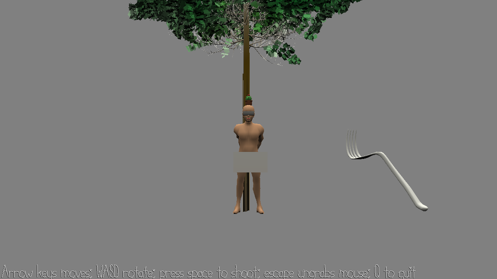

# Throwing Knife Master

Author: Tianjian Huang <thuang2@andrew.cmu.edu>

# Design
You and your best friend Bob got drunk. You decided to play a game. 
You tied Bob on a tree and put a cactus on his head. 
You try to hit the cactus with your throwing knife skills. 
Of course, you are not using a real knife. You are not totally drunk. But Bob is.  

# Screen Shot

# How To Play:
  
Use WASD to adjust the fork's direction, and arrow keys to move the fork's position.  
The goal is to hit the cactus. Press Space bar to shoot your fork.  
If you hit the cactus, you win; otherwise game is over.  
Press R to reset the game and Q to quit.  
  
# Sources
brunch.blend -- Yixin He
human -- https://free3d.com/3d-model/rigged-male-human-442626.html
tree -- https://free3d.com/3d-model/realistic-tree-pack-3-trees-95419.html
fork -- https://free3d.com/3d-model/fork-515242.html

This game was built with [NEST](NEST.md).

